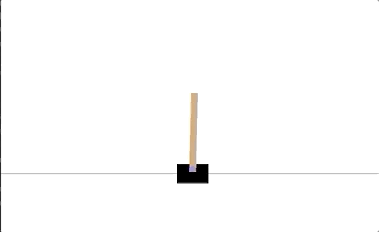

# reinforcement-learning-cross-entropy-Pytorch
Solution of Open AI CartPole environment using cross entropy method.
## Prerequsitiecs
1. Python3 

## Deployment
Follow the following steps to run the code: 

```shell script
$ git clone https://github.com/khordoo/reinforcement-learning-cross-entropy-Pytorch.git
$ cd reinforcement-learning-cross-entropy-Pytorch
$ python3 -m venv venv 
$ source /venv/bin/activate
$ pip3 install -r requirements.txt
$ python3 cartploe-cross-entropy.py 
```
To view the loss and reward trend charts in Tensorboard: 
```shell script
$ tensorboard --logdir runs/
```
The above command will run a local server on your machine, click on the provided link to open the tensorboard in your browser and view the charts

### Results
Here is an animation showing a trained agent playing the game.


